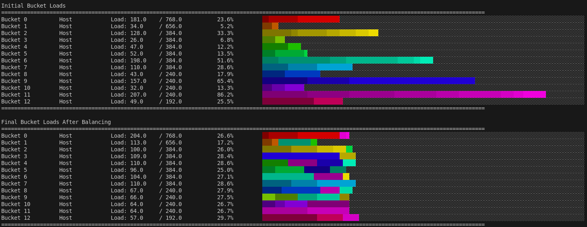
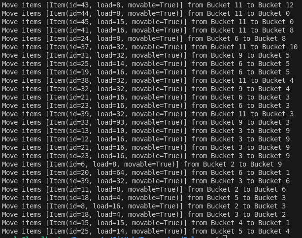
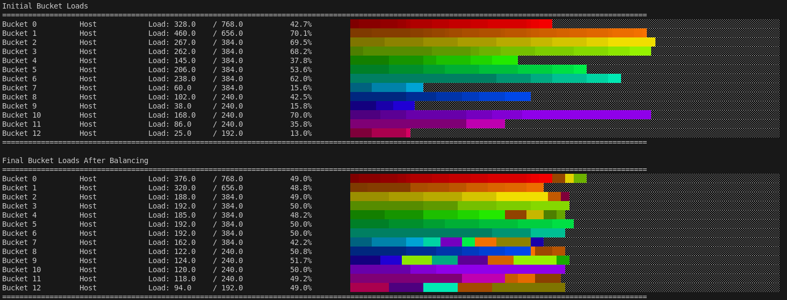

# Proxmox Cluster Load Balancer (Work-in Progress)
Load balancing solution for Proxmox clusters that optimizes memory usage across nodes. This project includes two modes:
- **Simulation Mode:**  Quickly test and visualize load balancing using simulated bucket data.
- **Production Mode:**  Connect directly to your Proxmox cluster, retrieve real node loads, balance the workload, and optimize move operations between nodes.


**Example Visualization of Rebalance Simulation:**


---

## Overview 
This repository contains a memory load balancer specifically designed for Proxmox clusters. It simulates and manages bucket loads, visualizes changes before and after balancing, calculates load statistics to measure the improvement, and optimizes the transfer of resources.

The project is organized into several modules:
- **BucketSimulator:**  Generates and distributes simulated loads across buckets.
- **BucketBalancer:**  Implements the logic to balance loads among buckets.
- **BucketVisualizer:**  Provides visualization of bucket load states to help assess the balancing.
- **LoadStatistics:**  Calculates statistical metrics (e.g., standard deviation) for load distribution.
- **ProxmoxManager:**  Connects with the Proxmox API to retrieve and manage node load information.
- **MoveOptimizer:**  Optimizes the list of movements required to balance the loads efficiently.

---

## Features 
- **Simulation:**  Test your load balancing strategy without a live Proxmox cluster.
- **Visualization:**  Graphically display bucket loads before and after balancing.
- **Load Analysis:**  Compute standard deviation to evaluate load distribution improvements.
- **Optimization:**  Refine move lists to reduce the number of operations needed to achieve balance.
- **Production Ready:**  Direct integration with Proxmox through API connectivity.

---

## Requirements 
- **Python 3.x**
- **Proxmox API Access:**  Ensure Proxmox Manager credentials and network connectivity.
- Additional dependencies as specified in the `requirements.txt`.

---

## Installation
#### Clone the repository to your local machine:
```bash
git clone https://github.com/coelacant1/ProxmoxLoadBalancer.git
cd ProxmoxLoadBalancer
```

#### Run the Setup Script: 
The provided setup.sh script will:
- Move the entire repository to /opt/ProxmoxLoadBalancer.
- Install dependencies.
- Copy the systemd service (loadbalancer.service) and timer (loadbalancer.timer) files to /etc/systemd/system.
- Reload systemd and enable/start the load balancer timer.

> **Important**: Update any Proxmox API credentials inside LoadBalancer.py before running the script.

#### Execute the script as follows:
```bash
chmod +x setup.sh
sudo ./setup.sh
```

#### Systemd Integration:
- **Service File (loadbalancer.service)**: Runs the main load balancer script located at /opt/ProxmoxLoadBalancer/LoadBalancer.py as a one-shot service.
- **Timer File (loadbalancer.timer)**: Schedules the service to run periodically (default: every 15 minutes, starting 5 minutes after boot). Adjust the timing parameters in this file as necessary.

### For Manual Testing:
Install the required dependencies:
```bash
pip3 install -r requirements.txt
```

Then execute the simulation or production balancer:
```bash
python3 LoadBalancer.py
```
---

## Balancing Algorithms
### Main Balancer
The primary load balancing algorithm is implemented in the BucketBalancer class and is the default. This algorithm uses an iterative greedy algorithm and has been the most consistent with least migrations in my testing. This algorithm calculates the target load for each bucket based on its capacity, and then iteratively moves the smallest item from the most overfilled bucket to the most underfilled bucket. It ensures that moves are allowed only when they do not exceed the destination bucket’s capacity and prevents oscillatory behavior by tracking recent moves. When the average load exceeds 80%, the algorithm halts further balancing to prevent overloading.

### Alternative Balancing Algorithms (Test Algorithms)
The repository also provides several alternative algorithms in the TestAlgorithms folder for experimental and performance evaluations. The available implementations include:
- **BuckBal_BinPack.py**: Implements a bin packing strategy to balance loads.
- **BuckBal_Genetic.py**: Uses a genetic algorithm to explore optimal moves.
- **BuckBal_Greedy1.py**: A greedy algorithm variation based on simple heuristics.
- **BuckBal_Greedy2.py**: A second greedy approach with alternate selection criteria.
- **BuckBal_Greedy3.py**: A third variant of the greedy strategy for load balancing.
- **BuckBal_MinCostMaxFlow.py**: Leverages a minimum-cost maximum flow algorithm.
- **BuckBal_SimulatedAnnealing.py**: Applies simulated annealing techniques to find balanced configurations.

---

## Simulation Mode 
Simulation mode allows you to test load balancing logic with virtual bucket loads. Use the following code example to simulate your environment:

**Example Output of the Rebalance Moves:**


**Example Visualization of the Rebalance Moves:**


```python
from BucketBalancer import BucketBalancer 
from BucketSimulator import BucketSimulator
from BucketVisualizer import BucketVisualizer
from LoadStatistics import LoadStatistics

# Define bucket capacities for the simulation
bucket_capacity_list = [768, 656, 384, 384, 384, 384, 384, 384, 240, 240, 240, 240, 192]

# Initialize the BucketSimulator to generate and distribute simulated loads
simulator = BucketSimulator(bucket_capacity_list)
buckets_initial = simulator.simulate()

# Visualize the initial state of the buckets
visualizer = BucketVisualizer(buckets_initial, "Initial Bucket Loads")
visualizer.assign_colors()
visualizer.visualize()
load_stats = LoadStatistics(buckets_initial)
std_dev_init = load_stats.calculate_standard_deviation()

# Execute bucket balancing
balancer = BucketBalancer(buckets_initial)
moves = balancer.balance_buckets()

# Visualize final state after balancing
visualizer = BucketVisualizer(buckets_initial, "Final Bucket Loads After Balancing")
visualizer.visualize()
load_stats = LoadStatistics(buckets_initial)
std_dev_post = load_stats.calculate_standard_deviation()

# Output the improvement metrics
print(std_dev_init, std_dev_post, (std_dev_init - std_dev_post) / std_dev_init * 100)

# Print the final move instructions
for move in moves:
    items_moved = ', '.join(str(item) for item in move['items'])
    print(f"Move items [{items_moved}] from Bucket {move['from']} to Bucket {move['to']}")
```
---

## Production  Mode (WORK-IN-PROGRESS)
> **Note**: This is a work-in-progress and not intended for use in production environments yet. This requires extensive testing. If you would like to contribute or validate with your test cluster, please do. Submit issues or changes via the Contributing section below.

Use production mode to connect to your actual Proxmox cluster and perform live load balancing. Update the API credentials and host information accordingly:

```python
from ProxmoxManager import ProxmoxManager
from BucketBalancer import BucketBalancer
from BucketVisualizer import BucketVisualizer
from LoadStatistics import LoadStatistics
from MoveOptimizer import MoveOptimizer

# Proxmox API connection details - Update these to match your environment
host = '192.168.1.10'
user = 'xxxxxx@pve'
password = 'ASecurePassword123'

# Initialize ProxmoxManager to manage node load information
proxmox_manager = ProxmoxManager(host, user, password)

# Retrieve buckets with current loads from specific hosts
specific_hosts = ['pve01', 'pve02', 'pve03', 'pve04']
buckets_initial = proxmox_manager.get_buckets(host_names=specific_hosts)

# Visualize the initial state of the buckets
visualizer = BucketVisualizer(buckets_initial, "Initial Bucket Loads")
visualizer.assign_colors()
visualizer.visualize()
load_stats = LoadStatistics(buckets_initial)
std_dev_init = load_stats.calculate_standard_deviation()

# Balance buckets based on real node usage
balancer = BucketBalancer(buckets_initial)
moves = balancer.balance_buckets()

# Visualize the final state after balancing
visualizer = BucketVisualizer(buckets_initial, "Final Bucket Loads After Balancing")
visualizer.visualize()
load_stats = LoadStatistics(buckets_initial)
std_dev_post = load_stats.calculate_standard_deviation()

print(f"Initial Std Dev: {std_dev_init}, Post-Balancing Std Dev: {std_dev_post}")
print(f"Improvement: {(std_dev_init - std_dev_post) / std_dev_init * 100:.2f}%")

# Optimize and print the final move instructions
optimizer = MoveOptimizer(moves)
optimized_moves = optimizer.optimize()

for move in optimized_moves:
    print(f"Move item {move['item_id']} from Bucket {move['from']} to Bucket {move['to']}")
```
> **Note:**  Ensure that the Proxmox API credentials, host addresses, and other configurations are correct and secure for your production environment.

---

## Contributing
If you would like to contribute to this repository, please follow these steps:
- Fork the repository on GitHub.
- Commit your changes (git commit -m 'Add some YourFeature').
- Push to the branch (git push origin main).
- Submit a pull request through the GitHub website.

---

## Support
For support, please open an issue in the GitHub repository or contact the maintainers.
